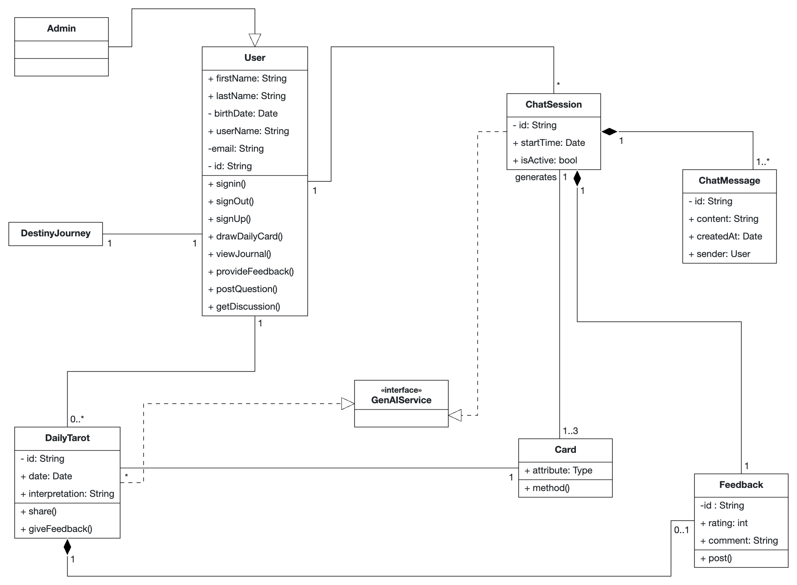
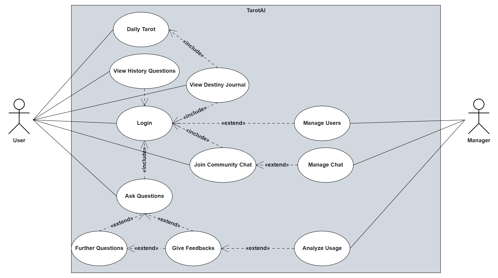
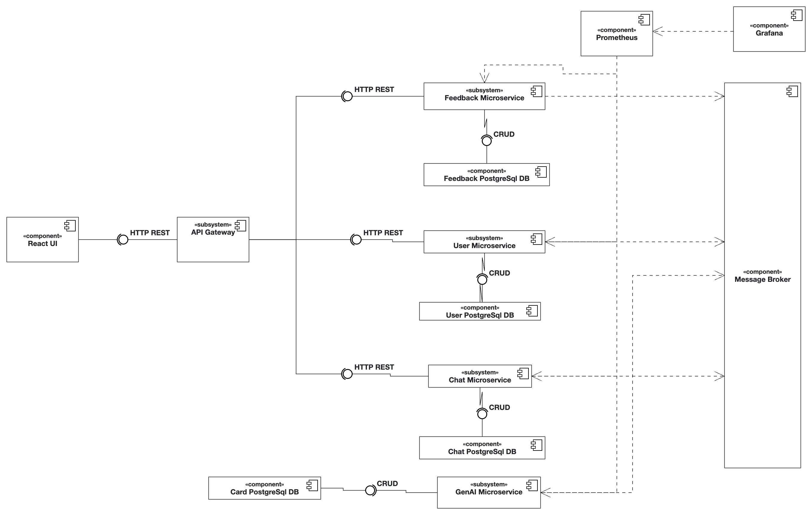

Website: https://team-divops-devops25.student.k8s.aet.cit.tum.de

Genai API: https://team-divops-devops25.student.k8s.aet.cit.tum.de/genai/health

# TarotAI: AI-Powered Tarot Furtune Teller

Many users seek guidance or emotional insight through tarot readings, but traditional tarot apps often feel rigid, overly mechanical, or too abstract. Our app aims to bridge the mystical elements of tarot with the conversational power of Generative AI, offering a personalized, emotionally resonant experience.

---

### 🎯 What is the Main Functionality?

- **Daily Tarot**: Personalized daily reading tailored to your past patterns.
- **Natural Language Tarot Reading**: Users ask questions in their own words; the system responds with relevant card readings powered by GenAI.
- **AI-Enhanced Interpretation**: Each card drawn is accompanied by a rich narrative-style explanation, tone-adapted to the user's question.
- **User Feedback Adaptation**: The app continuously learns from feedback to refine keyword associations in the vector database.

---

### 👥 Who Are the Intended Users?

- Individuals interested in tarot, astrology, or spiritual insight
- Casual users seeking a fun, gamified introspective tool
- Wellness app users who seek mental clarity or journaling prompts

---

### 📖 Example Scenarios

#### 🔮 Scenario 1: Casual Daily Use
- **User**: Click the "Daily Tarot" button.
- **App**: Draws 3 cards, gives a narrative: "Today are The Magician... A chance awaits you to use your full potential..."

#### 💔 Scenario 2: Emotional Decision
- **User**: "Should I give them another chance?"
- **App**: Draw 3 cards, explains with AI-generated empathy: "Your heart seeks clarity, but the signs hint toward imbalance..."

#### 📈 Scenario 3: Data-Driven Learning
- **User**: Rates the reading from 0 to 5 stars (e.g., 0 = not accurate, 5 = very accurate).
- **App**: If the user gives a rating of 4 or 5, the feedback and context are logged and added to the RAG system to enhance future retrieval and improve answer relevance for similar questions.

---
## 📦 Tech Stack

- **Client**: ReactJS with TypeScript, NodeJs, and Vite.
- **Server**: Spring Boot Java application with RESTful APIs.
- **GenAI**: Python, Langchain, FastAPI, Gemini API and Weaviate.
- **DevOps**: Docker, Kubernetes, Helm, GitHub Actions, Terraform, AWS and Ansible.

---

## System Overview
### Class Diagram


### Use Case Diagram


### Component Diagram


---

## Prerequisites
- Docker and Docker Compose
- Git

---

## Quick Start

```
# 1. Clone the repository
git clone git@github.com:AET-DevOps25/team-divops.git && cd team-divops

# 2. Start all services
docker-compose up -d

# 3. Verify deployment
curl -s https://team-divops-devops25.student.k8s.aet.cit.tum.de
```

---

## API Documentation

Backend SwaggerUI: https://team-divops-devops25.student.k8s.aet.cit.tum.de

GenAI SwaggerUI: https://team-divops-devops25.student.k8s.aet.cit.tum.de

There are also detailed docs for GenAI API under ```/genai``` file.

---

## Testing

### Client Testing
```
# Go to testing dir
cd client
# Run all unittest 
npm test
```

### Server Testing
```
# Go to testing dir
cd server
# Run all unittest 
```

### GenAI Testing
```
# Go to testing dir
cd genai/tests
# Run all unittest 
python test_all_systems.py
```

---

## Monitoring

---

## Deployment


### GitHub Workflows Guide

This project uses GitHub Actions for CI/CD automation, including build, test, and deployment to AWS and Kubernetes. The workflows are defined in `.github/workflows/`.

#### Key Workflows
- **client-deployment.yaml**: Builds, tests, and deploys the client (frontend) service.
- **genai-deployment.yaml**: Builds, tests, and deploys the GenAI (backend) service.
- **server-deployment.yaml**: (If present) Handles build and deployment for the server (Java backend).

#### Typical Workflow Steps
1. **Checkout Code**
   - Uses `actions/checkout` to pull the latest code from the repository.
2. **Set Up Environment**
   - Installs required tools (Node.js, Python, Java, etc.)
   - Sets up AWS credentials and configures the environment.
3. **Install Dependencies & Build**
   - Installs project dependencies (npm, pip, Maven, etc.)
   - Builds Docker images for each service.
4. **Run Tests**
   - Executes unit and integration tests for each component.
5. **Push Docker Images**
   - Pushes built images to GitHub Container Registry or another registry.
6. **Deploy to AWS/Kubernetes**
   - Uses Helm to deploy or upgrade services in the target Kubernetes cluster.
   - Uses Terraform for infrastructure provisioning (if needed).

#### Example: Deploy Client with Helm
```yaml
- name: Deploy Client to Kubernetes
  run: |
    helm upgrade --install team-divops-client ./helm/client \
      --namespace client-app \
      --set image.repository=ghcr.io/aet-devops25/team-divops-client \
      --set image.tag=${{ env.IMAGE_TAG }} \
      --create-namespace --wait
```

#### Secrets and Environment Variables
- Sensitive data (AWS keys, API tokens, etc.) are stored in GitHub Secrets and referenced in workflows.
- Common environment variables:
  - `AWS_ACCESS_KEY_ID`, `AWS_SECRET_ACCESS_KEY`, `AWS_REGION`
  - `IMAGE_REPOSITORY`, `IMAGE_TAG`, `KUBE_NAMESPACE`, `RELEASE_NAME`, `HELM_CHART_PATH`

#### Monitoring & Status
- Workflow status and logs can be viewed in the GitHub Actions tab.
- Failed steps will show error logs for troubleshooting.

#### Customization
- You can modify or add workflow files in `.github/workflows/` to fit your team's CI/CD needs.
- For more details, see the comments and steps in each workflow YAML file.

### Rancher: Helm Deployment Guide


This project supports deployment to Kubernetes using Helm charts for easy, repeatable, and configurable deployments.

#### Prerequisites
- Kubernetes cluster (local or cloud, e.g., AWS EKS)
- Helm 3.x installed ([Helm install guide](https://helm.sh/docs/intro/install/))
- Docker images built and pushed to a container registry (e.g., GitHub Container Registry)

#### Directory Structure
- `helm/client` — Helm chart for the client (frontend) service
- `helm/genai` — Helm chart for the GenAI service
- `helm/server` — Helm chart for the server (backend) service

#### Basic Usage

1. **Add Helm Repositories (if needed)**
   ```bash
   helm repo add stable https://charts.helm.sh/stable
   helm repo update
   ```

2. **Deploy Client Service**
   ```bash
   helm upgrade --install team-divops-client ./helm/client \
     --namespace client-app \
     --set image.repository=ghcr.io/aet-devops25/team-divops-client \
     --set image.tag=<IMAGE_TAG> \
     --create-namespace --wait
   ```

3. **Deploy GenAI Service**
   ```bash
   helm upgrade --install team-divops-genai ./helm/genai \
     --namespace genai-app \
     --set image.repository=ghcr.io/aet-devops25/team-divops-genai \
     --set image.tag=<IMAGE_TAG> \
     --create-namespace --wait
   ```

4. **Check Deployment Status**
   ```bash
   kubectl get pods -n client-app
   kubectl get pods -n genai-app
   ```

#### Customization
- You can override any value in `values.yaml` using `--set key=value` or by providing a custom `values.yaml` with `-f`.
- Example: set environment variables, resource limits, ingress, etc.

#### Uninstall
```bash
helm uninstall team-divops-client -n client-app
helm uninstall team-divops-genai -n genai-app
```

#### Notes
- Make sure your Kubernetes user has sufficient permissions to create resources in the target namespaces.
- For production, review and adjust resource requests/limits, secrets, and ingress settings as needed.

#### AWS: Terraform Deployment Guide

This project supports deployment to AWS using infrastructure-as-code and container orchestration tools. Below is a step-by-step guide for deploying the system on AWS.

#### Prerequisites
- AWS account with sufficient permissions (EKS, EC2, IAM, S3, etc.)
- AWS CLI configured locally or in CI/CD
- Terraform installed (for infrastructure provisioning)
- Docker installed (for building images)
- kubectl and Helm installed (for Kubernetes management)

#### 1. Infrastructure Provisioning with Terraform

1. Configure AWS credentials:
   ```bash
   export AWS_ACCESS_KEY_ID=your-access-key
   export AWS_SECRET_ACCESS_KEY=your-secret-key
   export AWS_DEFAULT_REGION=us-east-1
   ```
2. Initialize and apply Terraform scripts:
   ```bash
   cd terraform
   terraform init
   terraform plan
   terraform apply
   ```
   This will provision EKS cluster, networking, and other required resources.

#### 2. Build and Push Docker Images

1. Build images for each service:
   ```bash
   docker build -t ghcr.io/aet-devops25/team-divops-client:latest ./client
   docker build -t ghcr.io/aet-devops25/team-divops-genai:latest ./genai
   ```
2. Push images to your container registry:
   ```bash
   docker push ghcr.io/aet-devops25/team-divops-client:latest
   docker push ghcr.io/aet-devops25/team-divops-genai:latest
   ```

#### 3. Deploy to EKS with Helm

1. Update kubeconfig for your EKS cluster:
   ```bash
   aws eks update-kubeconfig --region us-east-1 --name <your-eks-cluster-name>
   ```
2. Deploy services using Helm (see Helm Deployment Guide above):
   ```bash
   helm upgrade --install team-divops-client ./helm/client \
     --namespace client-app \
     --set image.repository=ghcr.io/aet-devops25/team-divops-client \
     --set image.tag=latest \
     --create-namespace --wait

   helm upgrade --install team-divops-genai ./helm/genai \
     --namespace genai-app \
     --set image.repository=ghcr.io/aet-devops25/team-divops-genai \
     --set image.tag=latest \
     --create-namespace --wait
   ```

#### 4. Post-Deployment
- Verify pods and services:
  ```bash
  kubectl get pods -n client-app
  kubectl get pods -n genai-app
  kubectl get svc -A
  ```
- Access the application via the AWS LoadBalancer endpoint or configured domain.

#### 5. CI/CD (Optional)
- This project includes GitHub Actions workflows for automated build, test, and deployment to AWS. See `.github/workflows/` for details.

#### Notes
- For production, review security groups, IAM roles, and secrets management.
- Adjust resource requests/limits and autoscaling as needed.
- Clean up resources with `terraform destroy` when finished.

---


